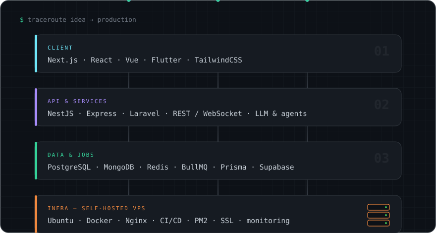

<a name="english-version"></a>

<div align="right">
  <a href="#french-version">🇫🇷 Français</a> &nbsp;|&nbsp; <a href="#english-version">🇬🇧 English</a>
</div>

<div align="center">
  
</div>

<div align="center">
  <a href="https://ibrahimdayende.me"></a>
  <a href="https://linkedin.com/in/ibrahimdayende"></a>
  <a href="https://x.com/ibrahimdayende"></a>
  <a href="mailto:dayende.ib@gmail.com"></a>
  
</div>


## 🧑‍🚀 About me

```ts
const ibrahim: Developer = {
  handle:     "Dayende-ib",
  name:       "Ibrahim Dayende",
  role:       "Fullstack Developer — from the UI down to the server",
  scope:      ["web", "mobile", "APIs", "data", "infrastructure", "AI"],
  runsOn:     "my own VPS (Ubuntu + Docker + Nginx)",
  learning:   ["microservices", "DevSecOps", "observability"],
  philosophy: "Ship it, monitor it, then make it boring.",
  funFact:    "I debug better with coffee ☕ and a good playlist 🎶",
};
```

I don't stop at `npm run build`. I design the interface, write the API, model the
database, containerize the whole thing and deploy it on my own server — then I keep
it alive. Generalist by choice: it's the fastest way to ship a product end to end.

**Currently:** building **MindEase**, an AI chatbot for preventive mental support.
**Open to:** freelance work, high-impact startups and open-source collaborations.


## 🧩 What I actually do

| | Domain | Concretely |
|:--:|---|---|
| 🎨 | **Frontend** | Next.js / React / Vue apps, design systems, responsive & accessible UI |
| 📱 | **Mobile** | Cross-platform apps with Flutter, offline-first when the network is weak |
| ⚙️ | **Backend** | REST & real-time APIs, auth, queues, background jobs, clean architecture |
| 🗄️ | **Data** | Relational & document modeling, migrations, caching, performance tuning |
| 🐧 | **DevOps / VPS** | Self-hosted deploys: Docker, Nginx reverse proxy, SSL, CI/CD, backups, monitoring |
| 🤖 | **AI** | LLM integrations, agents, RAG, chatbots plugged into WhatsApp & Messenger |
| 📈 | **Growth** | Automation, scraping, prospecting funnels and media buying |


## 🏗️ From idea to production

<div align="center">
  
</div>


## 🛠️ Stack

**Languages**


**Frontend & Mobile**


**Backend & APIs**


**Data & Queues**


**Infra & DevOps**


**AI & Automation**


## 🚧 Current projects

<table>
  <tr>
    <td width="50%" valign="top">
      <h3>🌟 MindEase</h3>
      <p>An AI chatbot for preventive mental support and everyday stress management. Runs over WhatsApp and uses Gemini for empathetic, personalized conversations.</p>
      <p>
        
        
        
        
      </p>
      <a href="https://mindeasev1.vercel.app"><b>🔗 Live beta</b></a>
    </td>
    <td width="50%" valign="top">
      <h3>🚀 Adfa Market</h3>
      <p>An intuitive, secure local marketplace. Uses Llama 8b to improve discovery and make it easier to trade goods and services between neighbours.</p>
      <p>
        
        
        
        
      </p>
      <a href="#"><b>🔗 Coming soon</b></a>
    </td>
  </tr>
</table>

<div align="center">
  <a href="https://ibrahimdayende.me"><b>→ More projects & case studies on ibrahimdayende.me</b></a>
</div>


## 📊 GitHub

<div align="center">
  
  
</div>

<div align="center">
  
</div>

<div align="center">
  
</div>

<div align="center">
  
</div>


## 🤝 Let's build something

Got a product to ship, an API to untangle or a server that keeps falling over?
Write to me — I read everything.

<div align="center">
  <a href="https://ibrahimdayende.me"></a>
  <a href="mailto:dayende.ib@gmail.com"></a>
  <a href="https://linkedin.com/in/ibrahimdayende"></a>
</div>

<br/>

<div align="right">
  <a href="#french-version">🇫🇷 Français</a> &nbsp;|&nbsp; <a href="#english-version">🇬🇧 English</a>
</div>

---

<a name="french-version"></a>

<div align="center">
  
</div>

<div align="center">
  <a href="https://ibrahimdayende.me"></a>
  <a href="https://linkedin.com/in/ibrahimdayende"></a>
  <a href="https://x.com/ibrahimdayende"></a>
  <a href="mailto:dayende.ib@gmail.com"></a>
</div>


## 🧑‍🚀 À propos

```ts
const ibrahim: Developpeur = {
  pseudo:      "Dayende-ib",
  nom:         "Ibrahim Dayende",
  role:        "Développeur Fullstack — de l'interface jusqu'au serveur",
  perimetre:   ["web", "mobile", "APIs", "data", "infrastructure", "IA"],
  tourneSur:   "mon propre VPS (Ubuntu + Docker + Nginx)",
  apprend:     ["microservices", "DevSecOps", "observabilité"],
  philosophie: "Livrer, monitorer, puis rendre ça ennuyeux.",
  funFact:     "Je débugue mieux avec un café ☕ et une bonne playlist 🎶",
};
```

Je ne m'arrête pas à `npm run build`. Je conçois l'interface, j'écris l'API, je
modélise la base, je conteneurise le tout et je le déploie sur mon propre serveur —
puis je le maintiens en vie. Généraliste par choix : c'est le chemin le plus court
pour sortir un produit de bout en bout.

**En ce moment :** je construis **MindEase**, un chatbot IA de soutien mental préventif.
**Ouvert à :** missions freelance, startups à fort impact et collaborations open-source.


## 🧩 Ce que je fais concrètement

| | Domaine | Concrètement |
|:--:|---|---|
| 🎨 | **Frontend** | Applis Next.js / React / Vue, design systems, UI responsive et accessible |
| 📱 | **Mobile** | Applis cross-platform en Flutter, offline-first quand le réseau est faible |
| ⚙️ | **Backend** | APIs REST & temps réel, auth, files d'attente, jobs de fond, archi propre |
| 🗄️ | **Data** | Modélisation relationnelle et documentaire, migrations, cache, perfs |
| 🐧 | **DevOps / VPS** | Déploiements auto-hébergés : Docker, reverse proxy Nginx, SSL, CI/CD, backups, monitoring |
| 🤖 | **IA** | Intégrations LLM, agents, RAG, chatbots branchés sur WhatsApp & Messenger |
| 📈 | **Growth** | Automatisation, scraping, tunnels de prospection et media buying |


## 🏗️ De l'idée à la production

<div align="center">
  
</div>


## 🛠️ Stack

**Langages**


**Frontend & Mobile**


**Backend & APIs**


**Data & Files d'attente**


**Infra & DevOps**


**IA & Automatisation**


## 🚧 Projets en cours

<table>
  <tr>
    <td width="50%" valign="top">
      <h3>🌟 MindEase</h3>
      <p>Un chatbot IA de soutien mental préventif, pensé pour aider à gérer le stress au quotidien. Intégré via WhatsApp, il s'appuie sur Gemini pour des échanges empathiques et personnalisés.</p>
      <p>
        
        
        
        
      </p>
      <a href="https://mindeasev1.vercel.app"><b>🔗 Voir la bêta</b></a>
    </td>
    <td width="50%" valign="top">
      <h3>🚀 Adfa Market</h3>
      <p>Une marketplace locale intuitive et sécurisée. Elle exploite Llama 8b pour améliorer la découverte et faciliter les échanges de produits et services entre voisins.</p>
      <p>
        
        
        
        
      </p>
      <a href="#"><b>🔗 Bientôt disponible</b></a>
    </td>
  </tr>
</table>

<div align="center">
  <a href="https://ibrahimdayende.me"><b>→ Plus de projets et d'études de cas sur ibrahimdayende.me</b></a>
</div>


## 📊 GitHub

<div align="center">
  
  
</div>

<div align="center">
  
</div>

<div align="center">
  
</div>

<div align="center">
  
</div>


## 🤝 On construit quelque chose ?

Un produit à sortir, une API à démêler ou un serveur qui tombe toutes les nuits ?
Écris-moi — je lis tout.

<div align="center">
  <a href="https://ibrahimdayende.me"></a>
  <a href="mailto:dayende.ib@gmail.com"></a>
  <a href="https://linkedin.com/in/ibrahimdayende"></a>
</div>

<br/>

<div align="right">
  <a href="#french-version">🇫🇷 Français</a> &nbsp;|&nbsp; <a href="#english-version">🇬🇧 English</a>
</div>
